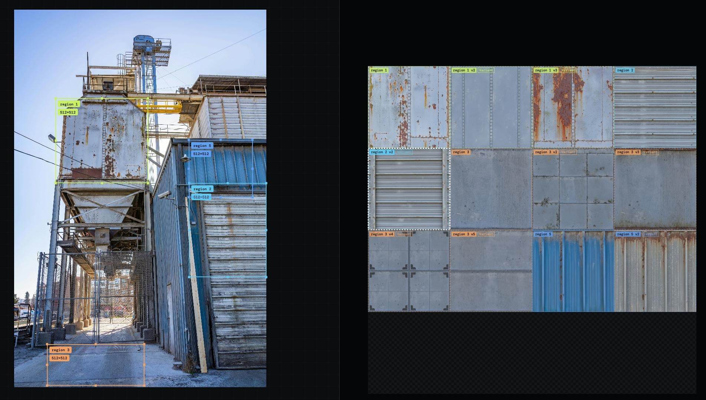

<div align="center">

# <br/>SnapAtlas

From photo to game-ready texture atlas in minutes.  
A free and open-source texture atlas and trim sheet tool for indie game dev.

[](LICENSE)

<a href="https://snapatlas.dev" target="_blank">
  <picture>
    <source media="(prefers-color-scheme: dark)" srcset="https://img.shields.io/badge/▶_Launch_SnapAtlas-4ea2ef?style=for-the-badge">
    
  </picture>
</a>

</div>

## 📸 Screenshot



<p align="end"><small>Photo by <a href="https://www.pexels.com/@robertkso">Robert So</a> from <a href="https://www.pexels.com">Pexels</a>.</small></p>

## 🧡 Why this exists

I was at the [Mont Saint Michel](https://en.wikipedia.org/wiki/Mont_Saint-Michel) and thought I wanted to make a level in this environment, even in low fidelity graphics. This is where I thought to have a tool that extracts surface from photos.

Went home and looked for one. Had to bounce between tools. Fix perspective, fix lighting, make it tile, pack it all by hand. Over and over. A lot of friction. Friction kills momentum.

Substance is great but it's expensive and honestly I just want something fast and lightweight. Drop a photo, draw some boxes, export your textures.

## 🎯 What it is

SnapAtlas lets you take a photo of a real-world surface and turn it into a game-ready texture atlas or trimsheet. Load a photo, define rectangular regions on it, process them through a pipeline of correction and cleanup steps, then pack the results into a single atlas texture you can export.

> **🧵 AI is optional.** The core pipeline (perspective, lighting, levels, curves, tiling) runs entirely offline with zero AI. A few AI-powered blocks augment the pipeline if you choose to add a Gemini API key. Images go directly from your browser to Google, never through our servers. AI is a helper, not the product.

## ✨ Features

- 📸 **Import photos** — drag-and-drop or file picker
- ✏️ **Draw regions** — mark texture areas directly on the photo
- 🧩 **Processing pipeline** — perspective, lighting, levels, curves, tiling texture, and more
- 🤖 **AI-powered blocks** — classification, albedo cleanup, seamless tiling (Gemini API, BYO key)
- 🔀 **Variant system** — multiple variants of a region with forked pipelines
- 👁️ **Live preview** — Packing wireframe, Atlas, Tile, and 3D Cube views
- 📐 **MaxRects bin-packing** — auto-arranges regions into a compact atlas
- 📦 **Export atlas or texture pack** — download a single packed atlas or bulk export individual textures
- 🎛️ **Per-region control** — toggle, resize, rotate, delete individual regions
- 🔍 **Perspective correction** — draggable corner handles with magnifier loupe
- 💾 **Project save/load** — `.snapatlas` files with full pipeline and cache
- 🌐 **100% client-side** — no server, no installation, no uploads

## 🚀 Quick start

1. Use the online version at **[snapatlas.dev](https://snapatlas.dev)** or open `index.html` locally
2. Drop a photo onto the canvas or click "+ Photo"
3. Draw regions to mark texture areas on the photo
4. (Optional) Add a Gemini API key for AI-powered blocks
5. Select regions and run the pipeline
6. Click "↓ Export" to download the packed atlas or bulk export a texture pack
7. The UV coordinate JSON is included alongside the atlas in the export

## 🔧 Build for production

```bash
bun install
bun run build   # outputs to dist/
```

Then serve `dist/` with any static file server.

## 📋 Technical notes

- Single-page application, no build step required for development
- Works offline after first load (all processing is client-side)
- AI features use the Google Gemini API, your images are never uploaded to any server the tool controls
- The live site uses opt-in, self-hosted [Umami](https://umami.is/) analytics (no cookies, no personal data) to understand which features are used and prioritize development. Tracks page views, photo imports, pipeline block usage, AI runs, and exports.
- Project files bundle source images as data URLs for full portability

## 🗺️ Roadmap

See [ROADMAP.md](ROADMAP.md) for planned features and future direction.

## ⚖️ License

MIT — see [LICENSE](LICENSE).
